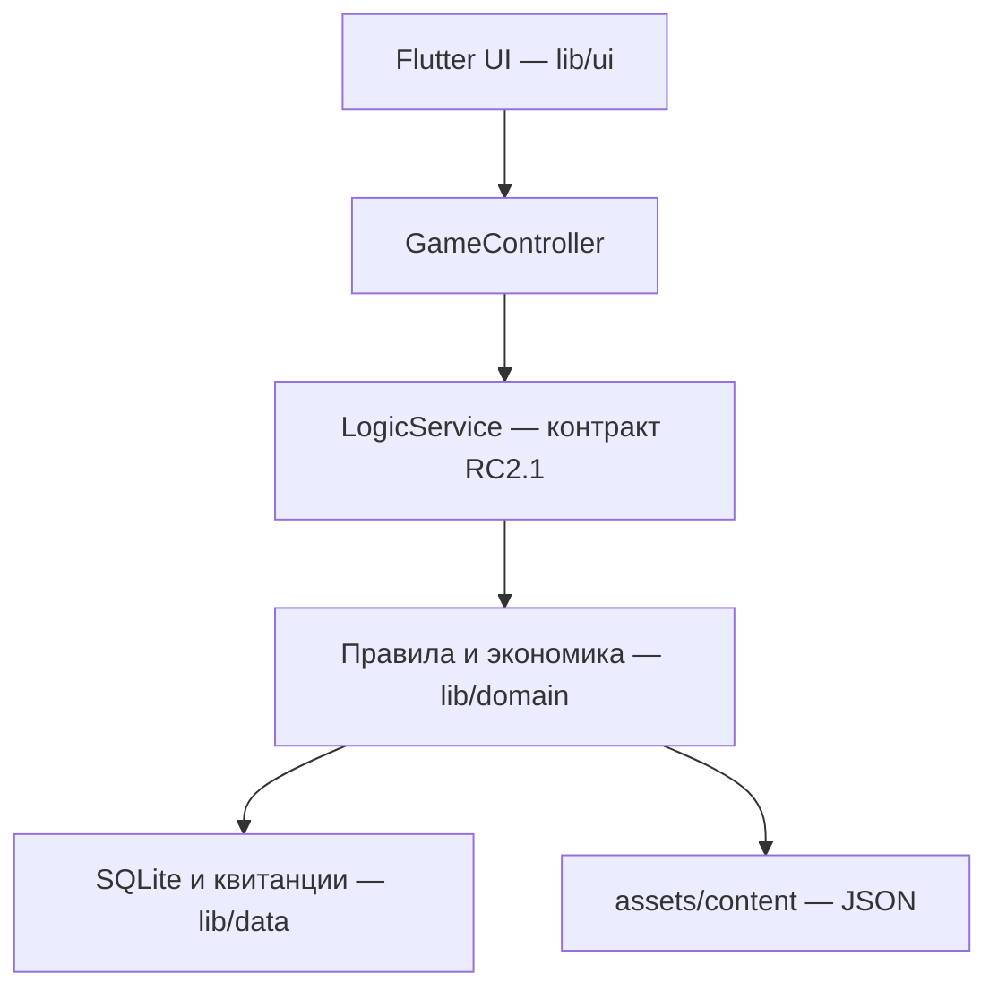

# Архитектура Финни

UI получает состояния и результаты команд через контракт. Предварительный просмотр не изменяет баланс; commit проверяет ревизию/поколение и выполняет операцию транзакционно. ActionId позволяет вернуть прежнюю квитанцию при повторе, конфликтующее содержимое отклоняется. Сброс меняет поколение. Удаление сохраняет отметку, препятствующую восстановлению профиля устаревшей командой.

SQLite хранит profile JSON snapshots, action_receipts и отметки удалённых профилей. Это не нормализованная модель с таблицей на каждую игровую сущность. Сервер отсутствует. Контент обновляется новой сборкой. Структура и правила подробно описаны в техническом документе релиза и контракте.
