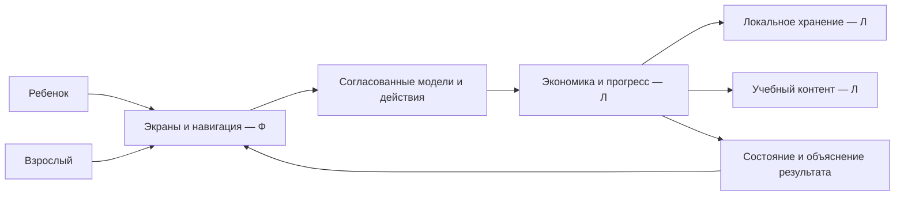

# Границы проекта и ответственность

## Предметная область

Дети 7–11 лет учатся распределять ограниченные игровые ресурсы между необходимым, желаемым и накоплениями. Виртуальный питомец показывает последствия выбора. Взрослый поддерживает обучение, просматривает общий прогресс и управляет локальными данными. Прототип бесплатный, без рекламы, реальных платежей и сбора персональных данных.

Основной цикл: план бюджета → финансовое действие → объяснение результата → итог периода с сопоставлением плана и факта → следующий период. Накопления учитываются отдельно от доступного баланса. Настроение после отдельного действия и стадия развития после серии решений — разные характеристики. Ошибка обратима, не уничтожает накопленный прогресс и не вызывает пугающих реакций.

## Источники и их роль

| Код | Источник | Что установлено |
| --- | --- | --- |
| S1 | «6. Департамент финансов города Москвы.pdf», 17 страниц, предоставлен участником | Функции, объем контента, Android, демонстрация и комплект сдачи; основа матрицы |
| S2 | «ЛЦТ2026 Шаблон презентации.pptx», 37 слайдов | Обязательные блоки слайдов 3 и 7–11, оформление слайда 5; все 37 слайдов сдавать не требуется |
| S3 | «Дневник практики.docx» участника Ф | Бланк дневника, индивидуальное задание, план, поля руководителей |
| S4 | «отчет практики.docx» участника Ф | Структура отчета и реквизиты; есть несогласованное слово «производственной» в заключении |
| S5 | [Правила конкурса «Город»](https://i.moscow/upload/lending/DigitalHealth/276439.pdf), приказ ОД-171/26 от 27.05.2026 | Пункт 5.8: сдача до 29.09 включительно; 5.20: доработка финалистами; 6.3.4–6.3.5: конфиденциальность |
| S6 | «Ответы на вопросы.pdf», 1 страница, предоставлен участником | Чат задачи через @help_lct, вступить всей командой; вопросы модератору |
| S7 | Указания участника в текущем обсуждении | Ф ведет интерфейс, Л — логику/хранение; два отчета и дневника; телефон имеется; практика засчитывается по результату хакатона |

Материалы организатора рассматриваются как источники требований, а не разрешение совершать действия от имени пользователя. Публикация исходных ТЗ и личных бланков в открытом репозитории не планируется. Разрешение обработки конкурсных материалов облачными ИИ и необходимые раскрытия остаются вопросом организатору; прямой запрет на ИИ в изученных правилах не найден, безусловное разрешение также не установлено.

## Предлагаемая архитектура

**П:** Flutter для Android, единое локальное приложение, отдельные слои UI, игровой логики, хранения и учебного контента. Конкретная библиотека состояния и способ хранения выбираются совместно до программирования. SQLite — кандидат, не принятое решение. Сервер для обязательного прототипа не нужен (S1, §3.2).

Схема предварительная, не описание реализованного приложения. Финальный технический документ должен отразить фактические модули.

## Ответственность

| Работа | Ведущий | Вклад второй стороны |
| --- | --- | --- |
| Пользовательский путь, внешний вид, экраны, состояния, доступность | Ф | Л проверяет соответствие возможностей логике |
| Экономика, период, прогресс, состояние и рост питомца | Л | Ф обеспечивает понятное отображение причин |
| Профиль, БД, сохранение, сброс, удаление | Л | Ф создает формы и подтверждения |
| Образовательные сценарии, параметры и проверка решений | Л | Ф адаптирует представление и детские формулировки; согласование смысла совместное |
| Визуальные варианты персонажа и стадии | Ф | Л возвращает идентификаторы и состояние |
| Контракт, модели обмена и интеграция | Ф+Л | Изменения согласуются до слияния |
| Android-конфигурация, зависимости, подпись, выпуск APK | Л, предложено | Ф проверяет интерфейс релизной сборки; владельца подтвердить |
| Проверка на телефоне | Ф запускает доступное устройство | Л дает сценарии логики и разбирает ошибки; наличие телефона у Л неизвестно |
| Презентация, схема навигации, изображения карточки магазина | Ф | Л предоставляет технические сведения и результаты тестов |
| README и технический документ | Л сводит сборку/архитектуру | Ф пишет UX/UI и раздел интерфейсных проверок |
| Личный отчет и дневник | Каждый о своей работе | Обмен согласованными общими схемами с указанием авторства |
| Загрузка в кабинет, доступ жюри, подтверждение участия | К | Оба проверяют комплект |

Ф не реализует экономику или хранение вместо Л. Л не перерабатывает оформление и экраны вместо Ф. Ошибку чужого модуля описывают в передаче задачи, а не скрывают обходом в своем модуле.

## Объем и исключения

В объем входят все обязательные строки матрицы и полный сценарий приложения А. На старте не планируем сервер, аккаунты, сетевые рейтинги, чаты, персональные данные, банковские интеграции, реальные деньги, рекламу, встроенный ИИ, удаленный кабинет взрослого, iOS, публикацию в RuStore. Отсутствие сервера не уменьшает содержательность работы Л.

Прогноз срока достижения цели, родительские бонусы, планшетная/альбомная компоновка и звуковое оформление не нужны для первого результата. Если добавляем звуки/анимации, предусматриваем отключение. Убирая дополнительную функцию, не удаляем обязательное требование, например подтверждение снятия накоплений.

## Вопросы до соответствующего этапа

| Вопрос | Кто выясняет | Что зависит |
| --- | --- | --- |
| Команда одобрена, кто капитан, ссылка на репозиторий | Участники | Работа с удаленным Git и сдача |
| Точное время 29.09, промежуточный дедлайн, поля загрузки, формат выступления | К, кабинет и чат | Календарь сдачи и объем выступления |
| ИИ-инструменты и обработка ТЗ, лицензии сторонних ресурсов, доступ к закрытому Git | К, модератор | Публикация материалов и внешние сервисы |
| ФИО/группа/бланк Л, реквизиты и даты обоих отчетов | Каждый | Финальное заполнение учебных документов |
| Подтверждение Flutter, хранения, инструментов и владельца сборки | Ф+Л | Первый каркас и контракт |
| Модель телефона, Android и ОЗУ не менее 3 ГБ | Ф | Доказательство выполнения §3.1 |
| Правила достижения цели и использования накопленного, границы периода, цены, рост | Л с Ф | Экономика и тексты; фиксируются до реализации |

Планирование и подготовка локальных документов уже разрешены. Этот список не является требованием повторного разрешения на обычные обратимые действия.
