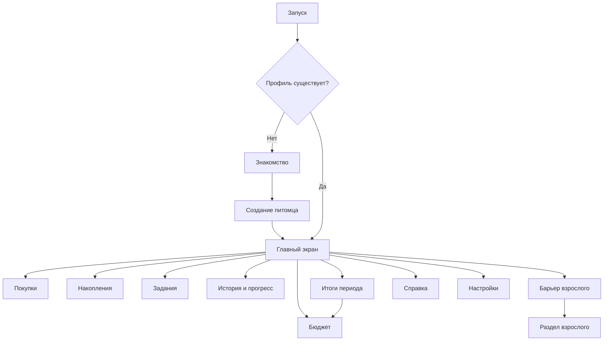

# Экраны и минимальный контент

Все экраны ниже — план. Номер экрана используется в матрице. Окна подтверждения не обязательно оформлять отдельными маршрутами.

## Перечень экранов

| ID | Экран | Содержание и состояния | Действия внутреннего модуля |
| --- | --- | --- | --- |
| E01 | Знакомство | Цель игры, «нужное / желаемое / коплю», гостевой вход; доступно повторно через справку | Загрузить профиль или начать создание |
| E02 | Создание питомца | Выбор внешности, игровое имя, предпросмотр; пустое имя/ошибка сохранения | Создать локальный профиль, сохранить внешность |
| E03 | Главный | Одновременно питомец, доступный баланс, накопления, цель, состояние и активное задание; без цели — приглашение выбрать | Получить полное состояние; все шесть направлений навигации |
| E04 | Бюджет | Три направления, доступная сумма и остаток; редактируемый черновик; после подтверждения план/факт | Проверить и подтвердить план; запрет превышения |
| E05 | Покупки | Каталог двух типов; цена, категория и ожидаемый эффект до покупки | Предпросмотр и покупка по ID |
| E06 | Накопления | Выбор из 3 целей, стоимость, накоплено, осталось; пополнение и снятие с предпросмотром | Выбрать цель, пополнить, снять |
| E07 | Задания | Список и интерактивный сценарий; правильное/неудачное решение и объяснение; награда и ее источник | Получить контент, проверить действие, начислить результат |
| E08 | Итоги периода | План/факт по направлениям, пополнения, причины состояния, следующий шаг | Завершить период и получить итог, перейти дальше |
| E09 | История и прогресс | Покупки периода, завершенные задания, цель, последний итог, стадии развития и причины | Читать историю/прогресс |
| E10 | Справка | Термины, повтор знакомства; короткие детские формулировки | Читать справочный контент |
| E11 | Вход взрослого | Простой барьер; не заявлять его полноценной защитой личности | Разрешить локальный переход после удержания/задания |
| E12 | Раздел взрослого | Образовательные цели, темы и общий прогресс без оценок ребенка; удаление/сброс; деморежим | Получить сводку, сбросить тестовый профиль, удалить данные |
| E13 | Настройки | Отключение анимаций/звука, если они включены; доступная навигация | Сохранить настройки |
| D01 | Подтверждение покупки | Цена, категория, эффект, остаток после покупки; отмена; нехватка и варианты | Подтверждение покупки, без изменения при отмене |
| D02 | Перевод накоплений | Сумма, доступный остаток; снятие только после отдельного подтверждения и показа уменьшения цели | Атомарный перевод, отмена без изменения |
| D03 | Удаление/сброс | Что будет удалено, отмена и явное подтверждение; различие сброса демо и удаления профиля | Только выбранное действие |
| D04 | Результат действия | Изменения денег и питомца, причина и следующий шаг; не только цвет/звук | Отобразить результат логики |

## Схема переходов

Каждый дочерний экран имеет понятный возврат. Действие сначала проходит проверки логики, затем обновляется интерфейс. Подтверждение бюджета не должно само списывать деньги. До планирования новый период не допускает обычные покупки по предлагаемому сценарию; точное правило закрепит Л.

## Минимум и проектное предложение наполнения

| Элемент | Обязательный минимум | Предложение, которое еще надо утвердить |
| --- | --- | --- |
| Внешность | 9 визуально различимых комбинаций | 3 формы/типа × 3 заметных варианта окраски; варианты отличаются не только близкими оттенками |
| Периоды | 5 последовательных без календарного ожидания в демо | Пять коротких раундов, явное завершение после просмотра итога |
| Задания | 6 по 3 темам | По 2 сценария на бюджет, сбережения, покупки; таблица ниже |
| Покупки | 8 двух типов | 4 обязательных: корм, вода, средство ухода, чистка домика; 4 желаемых: мяч, бантик, плакат, коврик; окончательная классификация должна быть понятна ребенку |
| Цели | 3 | Игровой домик, площадка для игр, набор путешественника; цены после проверки экономики |
| Развитие | 3 стадии | Малыш → подросший питомец → взрослый питомец; отдельно обратимое настроение/сытость |

Цены, доходы, награды и пороги роста сейчас не назначены. Л должен показать, что за период нельзя купить все, цели достижимы, ошибку можно исправить, а демо позволяет увидеть изменение роста после серии решений. Не выдавать будущие названия и баланс за требования организатора.

## Карта шести сценариев

| ID | Тема и навык | Действие ребенка | Логика и обратная связь, проект |
| --- | --- | --- | --- |
| Q01 | Бюджет: распределить ограниченную сумму | Распределить монеты между тремя направлениями | Сумма не превышает бюджет; показать остаток и последствия недостатка на нужное |
| Q02 | Бюджет: сопоставить план и факт | Исправить план следующего периода после разбора прошлого | Объяснить перерасход категории без стыда; прошлый подтвержденный план не переписывать |
| Q03 | Сбережения: регулярное пополнение | Выбрать цель и перевести часть доступных монет | Показать увеличение накоплений и уменьшение остатка до цели |
| Q04 | Сбережения: оценить снятие | Посмотреть последствия, подтвердить или отменить снятие | Уменьшение накопленного понятно до подтверждения; отмена сохраняет состояние |
| Q05 | Покупки: нужное и желаемое | Собрать покупки при ограниченном бюджете | Обязательная потребность и желаемая покупка конкурируют за ресурс; отказ от желаемого не ошибка |
| Q06 | Покупки: нехватка и восстановление | Попытаться купить дорогой предмет, затем выбрать доступное действие | Нет отрицательного баланса; заработать заданием или отложить покупку, объяснить выбор |

Мини-игры должны требовать действия с бюджетом/предметами/накоплениями. Набор из шести викторин с выбором ответа не закрывает §2.5.8. Для каждого сценария нужны удачный и неудачный пути с объяснением, детские тексты и проверка соответствия выбранным компетенциям.

## Обязательная демонстрация по приложению А

| Шаг | Что показать | Экраны | Доказательство |
| --- | --- | --- | --- |
| 1 | Установка и запуск релизного APK, знакомство | E01 | Устройство, версия, запуск |
| 2 | Локальный профиль без реальных имени, телефона и email | E02 | Игровое имя |
| 3 | Настройка внешности и имени | E02 | Выбранная комбинация |
| 4 | Стартовый бюджет, текущая цель/доступные задания | E03 | Сумма и источник |
| 5 | Распределение по трем направлениям | E04 | Подтвержденный план |
| 6 | Задание с объяснением и начислением | E07 | До/после, источник награды |
| 7 | По одной покупке каждого типа и попытка при нехватке | E05, D01 | История, отсутствие списания при отказе |
| 8 | Выбор цели и пополнение | E06 | Прогресс цели |
| 9 | Баланс, план/факт и состояние | E03, E08 | Функция обязательна, хотя отдельный живой показ шага 9 в таблице ТЗ не отмечен |
| 10 | Следующий период и изменение роста после серии решений | E08, E09 | Пять периодов, объяснение роста |
| 11 | Закрытие и повторный запуск | E03 | Сохранение полей, не только имени |
| 12 | Вход взрослого и удаление/сброс тестового профиля | E11, E12, D03 | Подтверждение и исходное состояние |

Живая демонстрация обязательна. Резервное видео до 3 минут не заменяет ее. Отдельно проверяются 9 вариантов внешности и весь контент; не пытаться вместить все проверки в трехминутный ролик.
