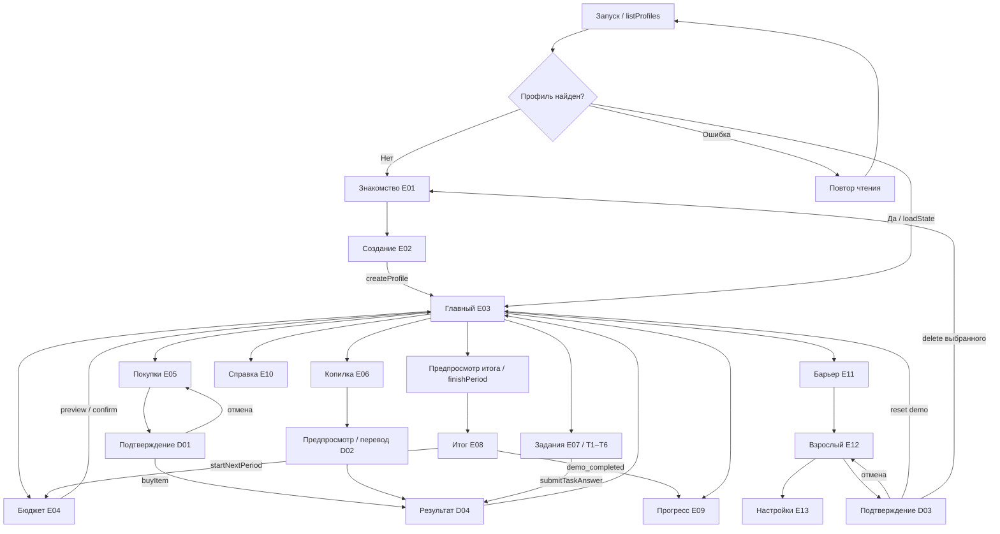
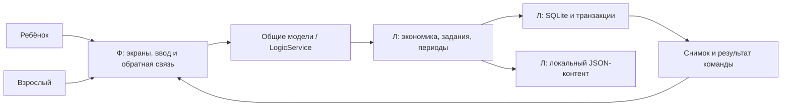

# Навигация и граница модулей

Проектирование от 24.09.2026, не схема уже работающего приложения.

Все дочерние экраны имеют возврат; на схеме он не дублируется для каждого ребра. Для reset и delete реальный переход определяется ответом сервиса и оставшимися профилями; нельзя создавать обычный профиль автоматически.

UI не обращается к SQLite и не определяет правильность задания, цену, награду, остатки или рост. Л не строит второй набор экранов. Самостоятельное состояние Ф ограничено черновиком ввода, выбором вкладки, состоянием загрузки и отображением подтверждения.
